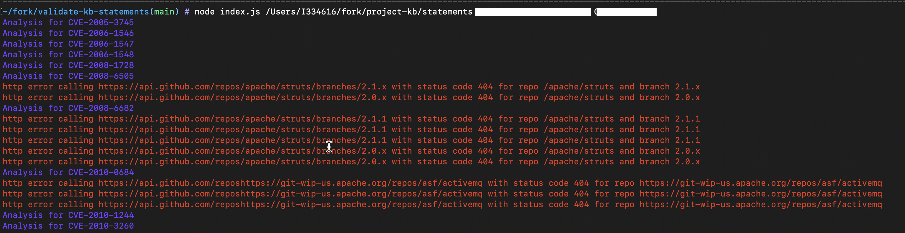

# Validate Project-Kb statements
Command line tool used to validate [kb-statements](https://github.com/SAP/project-kb/tree/vulnerability-data/statements)

## What does this cli validate?
Validates commits and branches in a kaybee statement

## Steps to validate
### Installation
1. Install node js
2. Run `npm install`
3. Clone the repository `git clone https://github.com/SAP/project-kb.git`
4. Checkout branch vulnerability-data `git checkout vulnerability-data --`

### Example commands
This example will limit the Git Repos to 50
```sh
node index.js STATEMENTS_FOLDER_PATH
```

This example will limit the Git Repos to 5000
```sh
node index.js STATEMENTS_FOLDER_PATH YOUR_GIT_USER_NAME YOUR_GIT_PASSWORD
```

### Output


